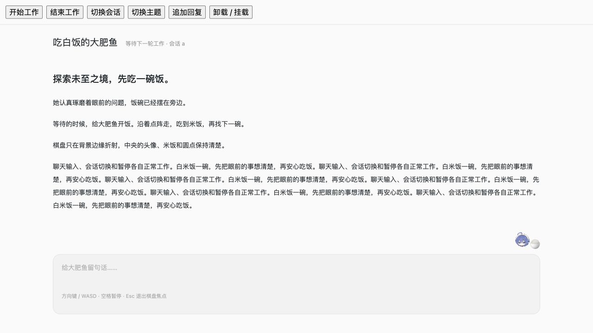

# DSH Snake

## 给吃白饭的大肥鱼开饭

DSH Snake 是 DeepSeek Harness 的贪吃蛇插件，围绕“吃白饭的大肥鱼”这个社区梗创作。272 × 208 px 的点阵棋盘，以清透液态玻璃样式悬浮在输入框正上方，靠右对齐。青绿色圆点蛇身按网格逐格移动，蛇头使用 DeepSeek 娘头像，食物是 🍚。拖动棋盘顶边可调整位置，右上角按钮可收起。玻璃只折射背景边缘，蛇和食物保持清晰。




截图来自独立验收页，使用模拟会话展示同一插件构建的实际渲染。[深色效果](assets/preview-dark.png)与[窄窗口效果](assets/preview-narrow.png)也已保存。

棋盘只在点击 DS 娘头像后展开。AI 开始或结束工作时，入口和棋盘保持当前状态。点击棋盘开始玩，点击右上角按钮收起。

## 安装

需要 Node.js 20 或更新版本，以及已初始化的 DeepSeek Harness 桌面配置。从源码安装还需要 Git。当前验证版本为 `0.2.0-rc.2`。

从 [Releases](https://github.com/songyu00yo/dsh-snake/releases) 下载 ZIP 安装包并解压。先退出 DeepSeek Harness，在解压得到的 `dsh-snake` 目录打开终端，执行：

```sh
npm run install:desktop
```

安装包已包含构建文件。这条命令不需要安装开发依赖。

从源码安装时，先退出 DeepSeek Harness，再执行：

```sh
git clone https://github.com/songyu00yo/dsh-snake.git
cd dsh-snake
npm ci
npm run build
npm run check
npm test
npm run install:desktop
```

重新打开应用。输入框上方会出现 DS 娘头像和一碗 🍚。悬停或聚焦时会提示“开饭啦”。点击 DS 娘头像后，棋盘在 420 毫秒内向上展开，末段轻微回弹。头像和饭碗共用 56 × 44 px 的点击区域。收起时，棋盘在 240 毫秒内下落、收束并淡出，随后显示头像入口。点击棋盘开始玩。系统开启“减少动态效果”时直接显示。空白会话也可手动展开游戏。

安装脚本把插件复制到 `~/.dsh/plugins/desktop/dsh-snake`，并注册到桌面配置。修改前备份配置和旧插件，备份位置会打印在终端。其他插件、聊天记录和应用本体保持原样。自定义数据目录时，可在命令前设置 `DSH_HOME`。

## 操作

点击棋盘开始或继续。拖动棋盘顶边可移动位置，拖动会暂停游戏。棋盘获得焦点后，以下按键生效：

| 按键 | 操作 |
| --- | --- |
| ↑ / W | 向上 |
| ↓ / S | 向下 |
| ← / A | 向左 |
| → / D | 向右 |
| 空格 | 暂停或继续 |
| Esc | 暂停并退出棋盘焦点 |

点击输入框即可正常打字，游戏会暂停。切换会话、窗口失去焦点或隐藏时也会暂停，返回后点击继续。

蛇身每 160 毫秒移动一格。吃一碗饭增长一节。穿过边界后直接从对面出现，撞到自己结束本局。死亡后按方向键或 WASD 会朝该方向立即重开。快速连续输入时，游戏会缓存两个有效转向。“收起”隐藏棋盘，点 DS 娘头像重新展开。各会话独立保留进度和棋盘位置，退出应用后清空。

## 更新与卸载

更新前退出应用，在仓库目录执行：

```sh
git pull --ff-only
npm ci
npm run build
npm run check
npm test
npm run install:desktop
```

卸载时退出应用，执行：

```sh
npm run uninstall:desktop
```

重新打开应用。卸载只删除本插件及其注册项。需要恢复时，从脚本打印的备份目录取回旧插件和配置。恢复整个配置前，请核对之后是否安装过其他插件。

## 开发

`engine.ts` 管理游戏规则，`glass.ts` 生成边缘折射图，`client.ts` 管理界面。构建会把 TypeScript 编译为 `dist/client.js`，并嵌入头像。素材离线可用。TypeScript 只用于开发和构建，插件运行时沿用宿主提供的 React，不新增运行依赖。

```sh
npm ci
npm run build
npm run check
npm test
```

修改后重新安装并重启应用。贡献要求见 [CONTRIBUTING.md](CONTRIBUTING.md)，代理工作规范见 [AGENTS.md](AGENTS.md)。

## 许可与素材

代码采用 [MIT](LICENSE)。头像作者为 **YunYueSama**，来源：[codex-deepseek-pet](https://github.com/YunYueSama/codex-deepseek-pet)。显示时裁切头部，原图未修改，适用上游署名许可。

液态玻璃算法改编自 Shu Ding 的 [liquid-glass](https://github.com/shuding/liquid-glass)，采用 MIT 许可。素材版本与许可见 [ASSETS.md](ASSETS.md)。这是社区插件，与 DeepSeek 官方无隶属关系。
