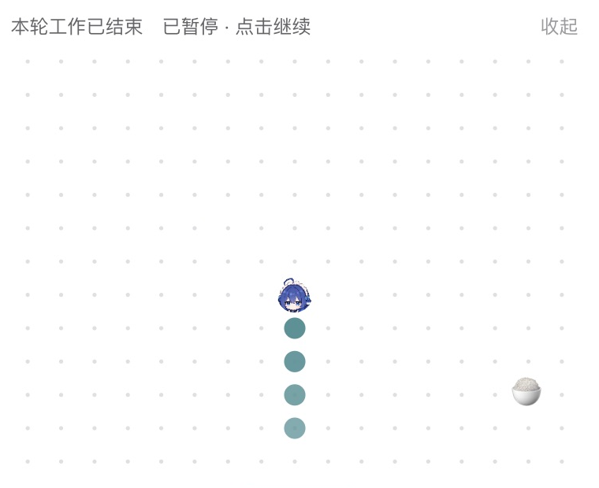

# dsh-snake

给吃白饭的大肥鱼开饭。




## 玩

点棋盘开始。方向键或 WASD 转向，空格暂停，Esc 退出。棋盘按住能拖走，右上角减号收起来。

吃到米饭长一节，撞到自己重来。

输入框上方那个小头像就是入口，鼠标放上去她会说开饭啦。

## 装

[Releases](https://github.com/songyu00yo/dsh-snake/releases/latest) 里有最新安装包。

想从源码装的话，跑这三行。

```sh
npm install
npm run build
npm run install:desktop
```

Node 20 起步。安装脚本把插件拷进 `~/.dsh`，改桌面版 profile，动手前先备份原文件。卸载跑 `npm run uninstall:desktop`。装完重启 DeepSeek Harness。

## 兼容

DeepSeek Harness 桌面版 0.2.0-rc.2
## 借来的东西

液态玻璃用的是 [shuding/liquid-glass](https://github.com/shuding/liquid-glass) 的位移图做法，MIT。

头像是 YunYueSama 的[大肥鱼项目](https://github.com/YunYueSama/codex-deepseek-pet)，按上游署名许可使用，细节见 [ASSETS.md](ASSETS.md)。

米饭走系统 emoji，没夹带额外的字体和图片。

本项目 MIT，全文在 [LICENSE](LICENSE)。

跟 DeepSeek 官方没关系，自己玩的。
